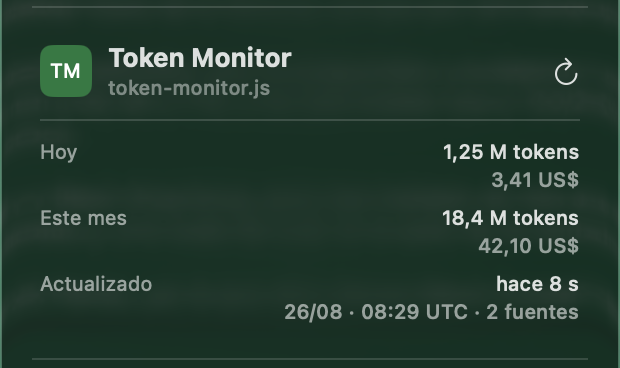

<div align="center">
    
    <h1>Token Monitor × CodexBar</h1>
    <p><strong>Token usage in CodexBar. Provider limits in Token Monitor.</strong></p>
    <p>Two local, opt-in bridges. Each app stays in charge of the data it collects.</p>
    <p>
        
        
        
        <a href="LICENSE"></a>
    </p>
    <p>
        <a href="#install-the-integration"><strong>Install</strong></a>
        · <a href="#what-this-fork-adds">What this fork adds</a>
        · <a href="docs/codexbar-plugin.md">Setup guide in Spanish</a>
    </p>
</div>

[ElRaxy/token-monitor](https://github.com/ElRaxy/token-monitor) is a community fork of Token Monitor. It adds a small bridge in each direction without combining the applications or their credentials.

## What this fork adds

| Direction | What you see | How it works |
| --- | --- | --- |
| **CodexBar → Token Monitor** | Provider quota limits, labelled `límites y cuotas` in Spanish | Token Monitor reads the authenticated loopback `dashboard-v1` snapshot. The applications stay independent and are not merged; CodexBar remains the owner of provider-limit collection. |
| **Token Monitor → CodexBar** | Today's tokens, this month's tokens and known cost, plus snapshot freshness | A local CodexBar plugin renders the three-row Token Monitor summary. The Spanish UI calls it a `resumen de uso`. |

The two integration directions are independent. They use separate endpoints, credentials and refresh cycles, and serving one endpoint never starts the opposite flow. The Spanish setup guide describes this as <span lang="es">dos flujos de integración independientes</span>.

## Install the integration

> [!IMPORTANT]
> This fork currently runs from source. Official Token Monitor downloads do not include the CodexBar bridge, and this repository does not publish fork-specific binaries yet.

### 1. Run this fork

Requires Node.js 22.15 or later.

```bash
git clone https://github.com/ElRaxy/token-monitor.git
cd token-monitor
npm install
npm start
```

### 2. Enable the summary

In Token Monitor **Settings**, enable the CodexBar summary bridge and copy its dedicated token.

### 3. Install the local provider

Use CodexBar 0.55.1, the version covered by the integration gate. Open **Settings → Plugins → Install…** and select [`integrations/codexbar/token-monitor.js`](integrations/codexbar/token-monitor.js). The same file can be placed manually in `~/.config/codexbar/providers/`.

Set `BASE_URL` to `http://127.0.0.1:17322`, save the copied token as the secure `SUMMARY_TOKEN`, approve that loopback origin and refresh CodexBar. The provider requests only `/api/integrations/codexbar/v1/summary`.

[Read the complete setup, token rotation and troubleshooting guide](docs/codexbar-plugin.md).

## Local by design

- Both bridges use authenticated loopback transport. Invalid or partial configuration fails closed, and CodexBar-owned providers never fall back to duplicate native probes.
- CodexBar receives only aggregate totals, known cost, source count and snapshot time. It does not receive prompts, responses, sessions, projects, models, file paths or Hub data.
- The summary endpoint is cache-only. A read does not start collectors, provider probes, watchers or filesystem scans.
- The two bridges use different bearer tokens. Neither token is written to URLs, command arguments, logs or the renderer.

The full contract and threat model live in the [CodexBar plugin guide](docs/codexbar-plugin.md) and the [CodexBar `dashboard-v1` configuration](docs/configuration.md#codexbar-dashboard-v1-limits).

<details>
<summary><strong>Verified native card capture</strong></summary>



<sub>This public-safe sample data capture records the first native CodexBar 0.55.1 gate. The current provider removes the redundant section heading and keeps the same three rows.</sub>

</details>

## Token Monitor reference

Token Monitor is the local-first desktop widget underneath this fork. The base app tracks usage across 32+ AI coding tools, syncs several devices and keeps prompts, responses and source code on the machine. The upstream project maintains the [full product documentation and translated READMEs](https://github.com/Javis603/token-monitor#readme).

Live token tracking covers Claude Code, Codex, Cursor, GitHub Copilot, Antigravity, OpenCode, and 26+ AI tools. Provider-limit checks cover Claude Code, Codex, Cursor, OpenRouter, third-party APIs, GLM, Kimi, and 21+ providers.

- **WSL usage (Windows)** reads file-backed usage from running distributions; SQLite-backed tools may need a [headless agent inside WSL](docs/wsl-sqlite-setup.md).
- [Configuration reference](docs/configuration.md), including **AI Tool Limits (provider selection, limits, and credentials)**.
- [API contract](docs/API.md) and [data export](docs/export.md).

<details>
<summary><strong>Open the supported-tools matrix</strong></summary>

<br>

## Supported tools

Token Monitor supports token usage, account-limit checks, and session details separately:

| Logo | Tool | Data path | Token Usage | AI Tool Limits | Session Details |
|:---:|------|-----------|:---:|:---:|:---:|
|  | Claude Code | `~/.claude/projects/`, `~/.claude/transcripts/` | ✅ | ✅ | ✅ |
|  | Codex | `~/.codex/` (`sessions/`, `archived_sessions/`) | ✅ | ✅ | ✅ |
|  | OpenCode | `~/.local/share/opencode/` (`opencode*.db`, `storage/message/`) | ✅ | ✅ | ✅ |
|  | Hermes Agent | `~/.hermes/state.db` | ✅ | — | — |
|  | OpenClaw | `~/.openclaw/agents/` | ✅ | — | — |
|  | Cursor | `~/.config/tokscale/cursor-cache/` | ✅ | ✅ | — |
|  | Antigravity | `~/.gemini/` (`antigravity/`, `antigravity-ide/`, `antigravity-backup/`, `antigravity-cli/conversations/`) | ✅ | ✅ | — |
|  | Cline | VS Code globalStorage tasks (`.../saoudrizwan.claude-dev/tasks/`), `~/.cline/data/sessions/` | ✅ | — | — |
|  | Kimi CLI / Kimi Code / Kimi Work | `~/.kimi/sessions/`, `~/.kimi-code/sessions/`, `<platform-app-data>/kimi-desktop/` | ✅ | ✅ | — |
|  | Qwen CLI | `~/.qwen/projects/` | ✅ | — | — |
|  | Grok Build | `~/.grok/` (`sessions/`, `logs/unified.jsonl`) | ✅ | ✅ | — |
|  | GitHub Copilot | VS Code `workspaceStorage/*/chatSessions/`, `~/.copilot/` (`otel/`, `data.db`) | ✅ | ✅ | — |
|  | Pi / Oh My Pi | `~/.pi/agent/sessions/`, `~/.omp/agent/sessions/` | ✅ | — | — |
|  | Zed | `~/.local/share/zed/threads/threads.db` | ✅ | — | — |
|  | Kilo Code | VS Code globalStorage tasks (`.../kilocode.kilo-code/tasks/`) — Linux & remote/WSL only | ✅ | — | — |
|  | Command Code | `~/.commandcode/projects/**/*.jsonl` | ✅ | ✅ | — |
|  | MiMo Code | `~/.local/share/mimocode/mimocode.db` | ✅ | ✅ | — |
|  | ZCode / GLM | `~/.zcode/` (`projects/`, `cli/db/db.sqlite`) | ✅ | ✅ | — |
|  | Kiro | `~/.kiro/sessions/cli/`, Kiro IDE globalStorage & `kiro-cli` DB | ✅ | ✅ | — |
|  | CodeBuddy | `~/.codebuddy/projects/` + IDE / VS Code extension logs | ✅ | — | — |
|  | WorkBuddy | `~/.workbuddy/projects/`, `~/.workbuddy/workbuddy.db` | ✅ | ✅ | — |
|  | Proma | `~/.proma/agent-sessions/*.jsonl` | ✅ | — | — |
|  | Qoder | `<platform-app-data>/QoderCN/SharedClientCache/cache/db/local.db` (CN only) | ✅ | ✅ | — |
|  | Reasonix | `~/.reasonix/` (`stats/`, `sessions/`, `projects/*/sessions/`) | ✅ | — | — |
|  | DeepSeek / DeepSeek Harness | `~/.dsh/sessions/` (`session.jsonl`, `session.jsonl.zstd`) | ✅ | ✅ | ✅ |
|  | Cherry Studio | `<platform-app-data>/CherryStudio/` (`Data/Agents/.claude/projects/` V2, `.claude/projects/` legacy) | ✅ | — | — |
|  | OpenRouter | OpenRouter API key (usage/key limit; balance when credits access is authorized, documented for Management keys) | — | ✅ | — |
|  | Minimax | Minimax API key (Token Plan quota via Minimax API) | — | ✅ | — |
|  | Volcengine | Ark API key or Volcengine AK/SK (Ark Coding Plan quota via Volcengine API) | — | ✅ | — |
|  | Ollama | Ollama Cloud cookie (session/weekly usage via ollama.com/settings) | — | ✅ | — |
|  | Trae CN | Trae CN access token (Trae CN / SOLO credits via trae.cn) | — | ✅ | — |
|  | Third-party APIs | New API / Sub2API-compatible account presets (including compatible One API forks), a New API API-key preset, and a Custom balance endpoint | — | ✅ | — |

<details>
<summary><strong>Notes, Custom balance endpoints, and data paths overridden by environment variables</strong></summary>

<br>

- Paths above are the defaults. Token Monitor follows the same environment overrides Tokscale does — `$XDG_DATA_HOME` for the `~/.local/share/` roots, and per-tool variables such as `$CODEX_HOME`, `$GROK_HOME`, `$HERMES_HOME`, `$KIMI_CODE_HOME`, `$DSH_HOME`, `$REASONIX_STATE_HOME`, `$REASONIX_HOME` and the `$CLINE_*` family.

- Command Code transcripts do not contain actual token counts or per-message model metadata. Token usage is estimated from transcript text, while model attribution and derived cost may reflect the currently configured model rather than the model historically used for each request.

- Custom maps numeric JSON fields from one GET balance endpoint; OpenAI or Anthropic compatibility alone is not enough.

#### Qoder CN (local adapter)

Qoder CN token usage is read from the app's local SQLite database, not an API — enable it in Settings → tools (opt-in, off by default). The database is auto-detected per platform: macOS `~/Library/Application Support/QoderCN/SharedClientCache/cache/db/local.db`, Windows `%APPDATA%\QoderCN\SharedClientCache\cache\db\local.db`, Linux `~/.config/QoderCN/SharedClientCache/cache/db/local.db` — overridable with `TOKEN_MONITOR_QODER_CN_DB_PATH`.

This is an advanced local integration: reading needs a `sqlite3` CLI on PATH or a Node runtime with unflagged `node:sqlite` (Node ≥ 23.4; the Electron widget may need the CLI). Read failures are logged, and an existing complete snapshot is retained instead of being replaced with zero usage. Costs are estimated from the models.dev catalog for each mapped model; the adapter may break if Qoder changes its database schema.
</details>

</details>

## Credits and release status

**Credits and licenses.** [Token Monitor](https://github.com/Javis603/token-monitor) was created by [Javis (`Javis603`)](https://github.com/Javis603); [CodexBar](https://github.com/steipete/CodexBar) was created by [Peter Steinberger (`steipete`)](https://github.com/steipete); this integration is maintained by [Alex (`ElRaxy`)](https://github.com/ElRaxy). Both upstream projects use the MIT License. This fork retains Token Monitor's original [MIT license and notices](LICENSE) and links to [CodexBar's MIT License](https://github.com/steipete/CodexBar/blob/main/LICENSE). It is an independent community project. There is no endorsement and no upstream affiliation.

**Releases.** [Fork releases](https://github.com/ElRaxy/token-monitor/releases) are separate from official upstream releases. The official [Token Monitor releases](https://github.com/Javis603/token-monitor/releases) and [CodexBar releases](https://github.com/steipete/CodexBar/releases) do not include this fork's CodexBar integration, and this repository does not currently publish fork-specific binaries. Fork-built installers still inherit Token Monitor's upstream release metadata, so they are not an independent update channel.

Contributions are welcome. Open changes against this fork for the integration, and use each upstream project's own repository for its core product.
